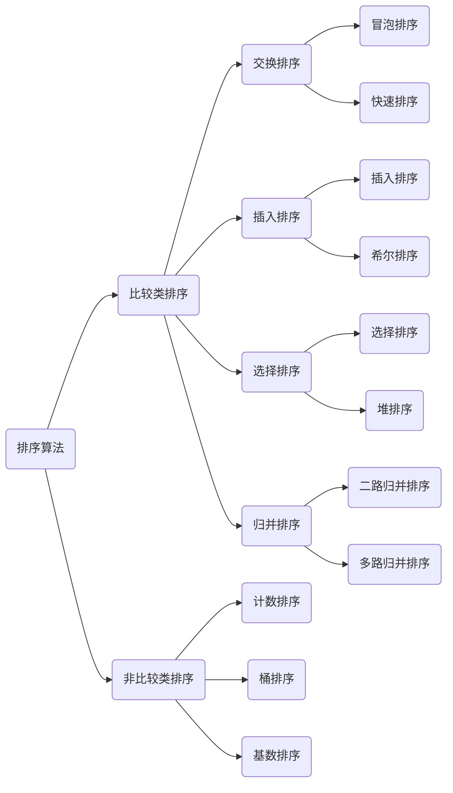

# [十大排序算法总结系列](https://leetcode-cn.com/leetbook/detail/sort-algorithms/)

# 0、算法概述

### 0.1算法总述 

在不同领域，排序算法的实现各有千秋。总体来看，排序算法大致可分为十类：

- 选泡插：选择排序、冒泡排序、插入排序
- 快归希堆：快速排序、归并排序、希尔排序、堆排序
- 桶计基：桶排序、计数排序、基数排序

这十种排序算法又可以分为两大类：

- **比较类排序**：通过比较来决定元素间的相对次序，由于其时间复杂度不能突破O(nlogn)，因此也称为非线性时间比较类排序。
- **非比较类排序**：不通过比较来决定元素间的相对次序，它可以突破基于比较排序的时间下界，以线性时间运行，因此也称为线性时间非比较类排序。



### 0.2 相关概念

- **稳定**：如果a原本在b前面，而a=b，排序之后a仍然在b的前面。
- **不稳定**：如果a原本在b的前面，而a=b，排序之后 a 可能会出现在 b 的后面。
- **时间复杂度**：对排序数据的总的操作次数。反映当n变化时，操作次数呈现什么规律。
- **空间复杂度：**是指算法在计算机内执行时所需存储空间的度量，它也是数据规模n的函数。 

### 0.3算法复杂度

| 排序方法 | 时间复杂度(平均) | 时间复杂度（最好） | 时间复杂度（最坏） | 空间复杂度 | 稳定性  |
| :------: | :--------------: | :----------------: | :----------------: | :--------: | :-----: |
| 冒泡排序 |     O(n^2^)      |        O(n)        |      O(n^2^)       |    O(1)    |  稳定✔  |
| 选择排序 |     O(n^2^)      |      O(n^2^)       |      O(n^2^)       |    O(1)    | 不稳定❌ |
| 插入排序 |     O(n^2^)      |        O(n)        |      O(n^2^)       |    O(1)    |  稳定✔  |
| 希尔排序 |    O(nlog(n))    |   O(nlog^2^(n))    |   O(nlog^2^(n))    |    O(1)    | 不稳定❌ |
| 归并排序 |    O(nlog(n))    |     O(nlog(n))     |     O(nlog(n))     |    O(n)    |  稳定✔  |
| 快速排序 |    O(nlog(n))    |     O(nlog(n))     |      O(n^2^)       | O(nlog(n)) | 不稳定❌ |
|  堆排序  |    O(nlog(n))    |     O(nlog(n))     |     O(nlog(n))     |    O(1)    | 不稳定❌ |
| 计数排序 |      O(n+k)      |       O(n+k)       |       O(n+k)       |    O(k)    |  稳定✔  |
|  桶排序  |      O(n+k)      |       O(n+k)       |      O(n^2^)       |   O(n+k)   |  稳定✔  |
| 基数排序 |      O(n*k)      |       O(n*k)       |       O(n*k)       |   O(n+k)   |  稳定✔  |


## 一、时间复杂度为o(n^2^)的排序算法

### 1、冒泡排序（Bubble Sort）

冒泡排序是一种最简单的排序算法。它重复走访过要排序的数列，一次比较两个元素，如果它们的顺序错误就把它们交换过来。走访数组的工作是重复进行的直到没有再需要交换的，及这个数组已经完成排序。

这个算法名字由来：由于越小的元素会经由交换慢慢“浮”到数组的顶端，所以叫冒泡排序。

#### 1.1 动图展示


#### 1.2 算法思想

冒泡是入门级算法，但是也有一些有趣的写法优化。通常来说，冒泡排序有三种写法：

- 一边比较一边后两两交换，将最大值/最小值冒泡到最后一位；
- 优化写法：是用一个变量记录当前轮次的比较是否发生过交换，如果没有发生交换，说明已经是有序的，不在继续排序。
- 进一步优化的写法：除了使用变量记录当前轮次是否发生交换外，再使用一个变量记录上次发生交换的位置，下一轮排序时到达上次交换的位置就停止比较。

**冒泡第一种写法:**

```cpp
//把容器中,i,j相互交换
void swap(vector<int>&arr, int i, int j) {
	int temp = arr[i];
	arr[i] = arr[j];
	arr[j] = temp;
}

//输出排序后数组中值
void printarr(vector<int> arr,string mode){
	cout << mode;
	for (int n:arr) {
		cout << n<<" ";
	}
}

//冒泡排序第一种写法
void bubbleSort(vector<int> arr_data) {
	//最外层经过n-1轮即排序完成
	for (int i = 0; i < arr_data.size()-1; i++) {
		for (int j = 0; j < arr_data.size()-1-i;j++) {
			if (arr_data[j]> arr_data[j+1]) {
				swap(arr_data, j, j + 1);
			}
		}
	}
	printarr(arr_data,"第一种冒泡排序后:");
}
```


**冒泡排序第二种写法：**

```cpp
```


#### [977. 有序数组的平方](https://leetcode-cn.com/problems/squares-of-a-sorted-array/)

```cpp
class Solution {
    public int[] sortedSquares(int[] nums) {
        for(int i = 0;i < nums.length;i++){
            nums[i] = nums[i] * nums[i];
        }
        // 选择排序算法
        bubbleSort(nums);
        return nums;
    }
    public void selectionSort(int[] arr){
        for(int i=0;i<arr.length-1;i++){
            int minIndex = i;
            for(int j = i+1;j<arr.length;j++){
                if(arr[j] < arr[minIndex]){
                    minIndex = j;
                }
            }
            if(minIndex != i){
                int temp = arr[minIndex];
                arr[minIndex] = arr[i];
                arr[i] = temp;
            }
        }
    }
    public void bubbleSort(int[] arr){
        for(int i=0;i<arr.length;i++){
            for(int j=0;j<arr.length-1-i;j++){
                if(arr[j]>arr[j+1]){
                    int temp = arr[j];
                    arr[j] = arr[j+1];
                    arr[j+1] = temp;
                }
            }
        }
    }
    public void insertionSort(int[] arr){
        for(int i=1;i < arr.length;i++){
            for(int j=i-1;j>=0;j-=1){
                if(arr[j]>arr[j+1]){
                    int temp =arr[j];
                    arr[j] = arr[j+1];
                    arr[j+1] = temp;
                }
            }
        }
    }
    public static void shellSort(int[] arr) {
        for (int step = arr.length / 2; step > 0; step /= 2) {
            for (int i = step; i < arr.length; i++) {
                for (int j = i - step; j >= 0; j -= step) {
                    if (arr[j] > arr[j + step]) {
                        int temp = arr[j];
                        arr[j] = arr[j + step];
                        arr[j + step] = temp;
                    }
                }
            }
        }
    }
    public static void quickSort(int[] arr) {
    quickSort(arr, 0, arr.length - 1);
}

    public static void quickSort(int[] arr, int left, int right) {
        int l = left;                       //左下标
        int r = right;                      //右下标
        int p = arr[(left + right) / 2];    //基准值
        //交换基准值左右大小值
        while (l < r) {
            //在基准值的左边一直找，直到找到大于等于基准值后才退出
            while (arr[l] < p) { l++; }
            //在基准值的右边一直找，直到找到小于等于基准值后才退出
            while (arr[r] > p) { r--; }
            //如果l>=r则说明：基准值左侧的值都小于基准值右侧的值
            if (l >= r) {
                break;
            }
            //将基准值左侧找到的小值与基准值右侧找到的大值进行交换
            int temp = arr[l];
            arr[l] = arr[r];
            arr[r] = temp;
            //如果交换完后，发现这个arr[r]等于基准值，l++向前移
            if (arr[r] == p) { l++; }
            //如果交换完后，发现这个arr[l]等于基准值，r--向前移
            if (arr[l] == p) { r--; }
        }
        //这一步来防止堆栈溢出
        if (l == r) {
            l++;
            r--;
        }
        //向左递归进行快速排序
        if (left < r) {
            quickSort(arr, left, r);
        }
        //向右递归进行快速排序
        if (right > l) {
            quickSort(arr, l, right);
        }
    }
    public static void mergeSort(int[] arr) {
    int temp[] = new int[arr.length];
    mergeSort(arr, 0, arr.length - 1, temp);
}

public static void mergeSort(int[] arr, int left, int right, int[] temp) {
    if (left < right) {
        int middle = (left + right) / 2;                //首先获取中间索引
        mergeSort(arr, left, middle, temp);             //向左递归进行分解
        mergeSort(arr, middle + 1, right, temp);    	//向右递归进行分解
        merge(arr, left, middle, right, temp);          //合并左右两个数组
    }
}

    public static void merge(int[] arr, int left, int middle, int right, int[] temp) {
        int pl = left;          //定义一个指针，指向左边有序序列的初始索引
        int pr = middle + 1;    //定义一个指针，指向右边有序序列的初始索引
        int i = left;           //定义一个指针，指向temp数组的初始化索引
        //比较左右两边序列中的元素大小，把小的数填充到 temp
        while (pl <= middle && pr <= right) {
            if (arr[pl] <= arr[pr]) {
                temp[i++] = arr[pl++];
            } else {
                temp[i++] = arr[pr++];
            }
        }
        //左边的有序序列还有剩余的元素，就全部填充到 temp
        while (pl <= middle) {
            temp[i++] = arr[pl++];
        }
        //右边的有序序列还有剩余的元素，就全部填充到 temp
        while (pr <= right) {
            temp[i++] = arr[pr++];
        }
        //将 temp 数组中的元素拷贝到 arr 数组对应位置处
        for (int index = left; index <= right; index++) {
            arr[index] = temp[index];
        }
    }
}
```


## 参考资料：

1：leetcode的：[排序算法全解析](https://leetcode-cn.com/leetbook/detail/sort-algorithms/)

2：菜鸟的：[十大经典排序算法](https://www.runoob.com/w3cnote/ten-sorting-algorithm.html)

3：[十大经典排序算法（动图演示）](https://www.cnblogs.com/onepixel/p/7674659.html)

4：[可视化展示排序算法过程网站](https://visualgo.net/zh/sorting)

